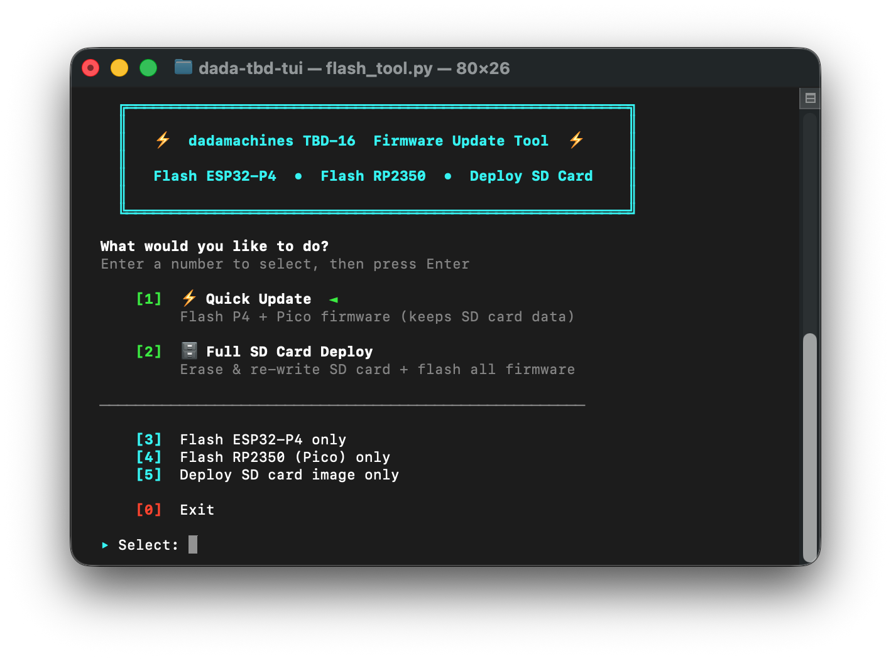

# dadamachines TBD-16 Firmware Update Tool

A terminal-based wizard to update your **dadamachines TBD-16** — flash ESP32-P4 firmware, RP2350 (Pico) firmware, and deploy SD card images. An alternative to the [browser-based flash tool](https://dadamachines.github.io/ctag-tbd/flash/10_stable_channel.html).



Works on **macOS**, **Linux**, and **Windows**.

## Download

> **[⬇ Download latest release](https://github.com/dadamachines/dada-tbd-tui/releases/latest)**
>
> Download the `.zip`, unzip, and run `./flash.sh` (macOS/Linux) or `flash.bat` (Windows).

Or clone with git:

```bash
git clone https://github.com/dadamachines/dada-tbd-tui.git
cd dada-tbd-tui
```

## Getting Started

**macOS / Linux:**
```bash
./flash.sh
```

**Windows:**
```
flash.bat
```

That's it. The launcher scripts find (or help you install) Python automatically, and `esptool` is installed into a local virtual environment on first run — no manual setup needed.

> **Already have Python 3.8+?** You can also run `python3 flash_tool.py` directly.

## Quick Start

```bash
# Interactive wizard (recommended)
./flash.sh

# Quick update — flash latest stable P4 + Pico firmware
./flash.sh --quick

# Full SD card deploy — erase & re-write SD + flash firmware
./flash.sh --full

# Use beta channel (staging)
./flash.sh --quick --channel beta

# Use a specific feature branch
./flash.sh --quick --channel feature-test-xyz
```

On Windows, replace `./flash.sh` with `flash.bat`.

## Update Methods

### ⚡ Quick Update
Flash P4 + Pico firmware. Keeps your SD card data (samples, presets, macros) intact.

1. Connect **front JTAG port** (USB-C #3) + a **back port** (#1 or #2) for power
2. Tool downloads & flashes the ESP32-P4 firmware
3. Hold **BOOTSEL button** on front panel, plug **back Port #2** → release button → tool copies UF2

### 🗄️ Full SD Card Deploy
Erase & re-write the SD card image, then flash all firmware. Use for fresh installs or SD card recovery.

**Via USB (MSC mode)** — no need to open the device:
1. Tool flashes MSC firmware → SD card appears as USB drive on back Port #1
2. Downloads & extracts the SD card image
3. Flashes the P4 firmware (restores normal boot)
4. Flashes the RP2350 Pico firmware

**Via external card reader** — requires opening the device:
1. Remove SD card, insert into reader
2. Tool writes the SD card image
3. Re-insert card, flash firmware as above

## Hardware Ports

| Port | Location | Purpose |
|------|----------|---------|
| USB-C #3 (JTAG) | **Front** | Serial flash (P4) |
| USB-C #1 | **Back** | Power + USB Ethernet (WebUI) + USB MIDI + SD card (MSC) |
| USB-C #2 | **Back** (edge) | Power + RP2350 BOOTSEL flash |

## CLI Options

```
--quick              Quick Update (P4 + Pico, no SD erase)
--full               Full SD Deploy (SD image + P4 + Pico)
--channel CHANNEL    Firmware channel (default: stable)
                       stable, beta, staging, or feature-test-NAME
--p4-only            Flash only ESP32-P4
--pico-only          Flash only RP2350 Pico
--install-esptool    Install/upgrade esptool
```

**Channels:** The interactive wizard shows two channels — **Stable Channel** and **Beta Channel** — matching the [web flasher](https://dadamachines.github.io/ctag-tbd/flash/10_stable_channel.html). Beta Channel includes the latest staging build plus any active feature-test branches.

## Troubleshooting

| Problem | Fix |
|---------|-----|
| `Python not found` | Install Python 3.8+ — the launcher scripts will guide you |
| `ensurepip is not available` (Linux) | `sudo apt install python3-venv` (Debian/Ubuntu) or `sudo dnf install python3-libs` (Fedora) |
| No serial port detected | Make sure the **front JTAG USB-C port** is connected. If it still doesn't appear: unplug all cables → hold **BOOT button** (on the back, between Port #1 and #2) → plug in JTAG while holding BOOT → release BOOT after 2 seconds → reconnect a back port for power |
| `No serial data received` | Try the other USB port, or a different cable. Enter download mode manually (see row above) |
| Flash fails / timeout | Re-run — the tool retries automatically. Power-cycle the TBD-16 if stuck |
| SD card not appearing (MSC mode) | Wait 20–30 seconds. Replug back Port #1. Try a powered USB hub (older Macs may have weak USB power). The tool will guide you through retries |
| Device stuck in MSC mode | The tool restores normal boot automatically. Or use menu option **[3] Flash ESP32-P4 only** |
| SD card needs separate deploy | Use menu option **[5] Deploy SD card image only** with an external card reader |
| Colors hard to read | macOS Terminal.app uses a white background by default. The tool auto-detects this and adjusts colors. If colors are still hard to read, switch to a dark terminal profile |
| Device crashes after SD update | macOS `._` dot-files — the tool cleans these automatically. Re-run Full SD Deploy if needed |

## Firmware Source

All firmware is served from [dadamachines.github.io/dada-tbd-firmware](https://dadamachines.github.io/dada-tbd-firmware/) (GitHub Pages CDN). Downloads are cached in your system temp directory.

## License

This tool is licensed under the [GNU Lesser General Public License (LGPL 3.0)](https://www.gnu.org/licenses/lgpl-3.0.txt).

© 2026 [Johannes Elias Lohbihler](https://dadamachines.com) for dadamachines.